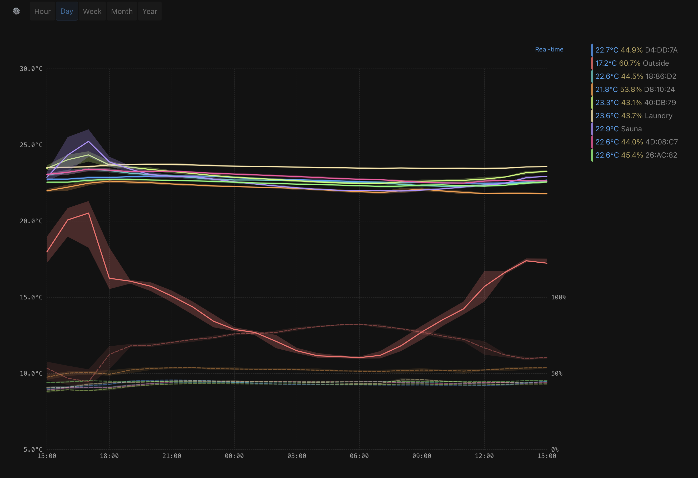

# Ruuvi Home Lite

[](https://opensource.org/licenses/MIT)
[](https://nodejs.org/)

Minimal Ruuvi sensor data visualization with real-time graphs. A lightweight, self-hosted solution for monitoring RuuviTag sensors via Ruuvi Gateway with secure MQTT communication. AI co-coded for robust architecture and security.



## ⚠️ Security Notice

**This project is designed for local network deployment only. Never expose to the internet without proper security hardening.**

See [`SECURITY.md`](SECURITY.md) for complete security documentation and best practices.

## ✨ Features

- 🔐 **Secure MQTT broker** with TLS 1.2+ encryption
- 📊 **Real-time visualization** with WebSocket updates
- 🗄️ **Local SQLite storage** (no cloud dependencies)
- 📱 **Progressive Web App** with offline support
- 🌙 **Dark mode interface** (system-matching design)
- ⏰ **Flexible time ranges** (day/week/month/year)
- 🐳 **Docker support** for containerized deployment

## 🚀 Quick Start

### Interactive Setup (Recommended)

```bash
git clone https://github.com/your-username/ruuvi-home-lite.git
cd ruuvi-home-lite
make launcher    # Interactive menu with all options
```

### Direct Commands

```bash
# Native Deployment (Raspberry Pi)
make setup && make start

# Docker Deployment
make setup-docker && make docker-secure

# Development
make dev

# Set up Nginx subdomain (optional)
cd nginx && sudo ./install-nginx.sh
```

## 🌐 Access Options

- **Direct Access**: `http://your-host-ip:3000` or `https://your-host-ip:3000` (if TLS enabled)
- **Subdomain Access**: Use the included Nginx configuration for `subdomain.local.network`

## 🛠️ Available Commands

- `make launcher` - Interactive menu with all options
- `make help` - Show all available make targets
- `make setup/setup-docker` - Environment setup
- `make start/docker-secure` - Production deployment
- `make dev` - Development mode
- `make cleanup` - Interactive removal
- `make docker-status` - Check Docker deployment
- `scripts/troubleshoot-mosquitto.sh` - MQTT diagnostics
